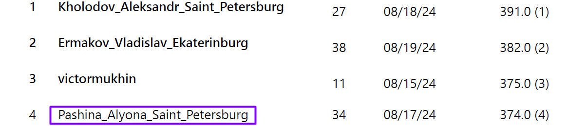
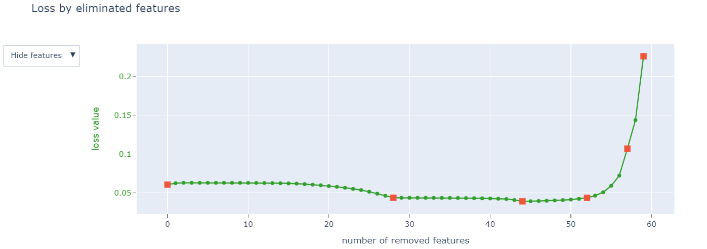

# Предсказание посетителя здания по времени и турникету

Тестовое задание для поступления на [ШИФТ Курс Machinе Learning](https://team.cft.ru/start/school/ml) с возможностью последующего трудоустройства в компанию ЦФТ.

Предоставлена информация от дате и времени (`ts`) прохождения через конкретный турникет (`gate_id`) конкретным посетителем (`user_id`).
Тренировочная выборка содержит 56 уникальных посетителей, тестовая - 34. В тестовой выборке id посетителей закодированы словами, необходимо отгадать, кто за ними скрывается. В тестовой выборке может быть не более 10% новых посетителей, не присутствовавших в тренировочной выборке (им нужно проставить id = -999).

Каждому слову сопоставлен вес, который зависит от того, насколько трудно предсказать id. Баллы набираются как взвешенная по весам сумма правильных ответов. Чем сложнее отгадали слово, тем больше баллов.

**Результат** - 4 место из 90

В ходе работы были выполнены следующие шаги:
- анализ данных
- генерирование признаков
- подбор гиперпараметров на кросс-валидации с использованием фреймворка optuna (в качестве алгоритма классификации использовала CatBoost)
- отбор признаков с помощью метода-обертки, который рекурсивно удаляет признаки на основе оценки важности для каждого признака
- разработка алгоритма, который расшифровывает закодированные id-посетителей, на основе предсказаний построенной модели

График изменения функции потерь по мере удаления признаков:

